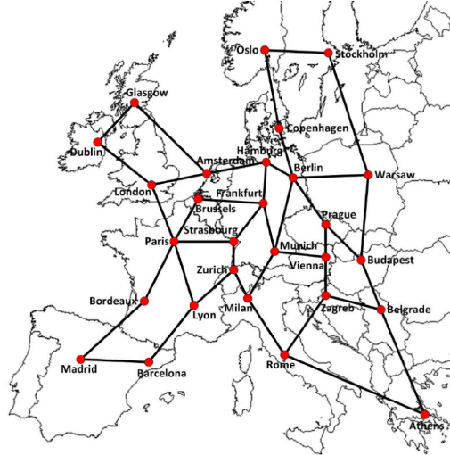
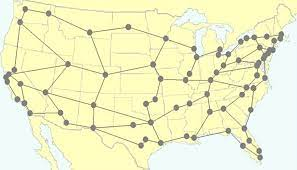
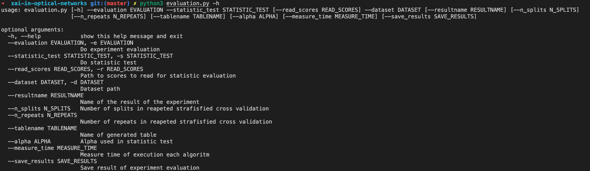
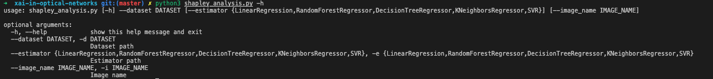
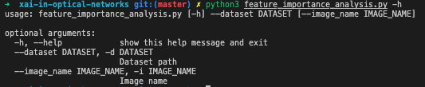

# Network Traffic Prediction

## Dataset
The data was captured in Europe - dataset Euro28 and in USA - dataset US26 in optical network infrastracture and in the next step was generated using original one.

## Euro28

## US26

## How run experiment?
### Main experiment
Run `evaluation.py` script with specific options.
  

In case of run all experiment you can run `run_experiment.sh` script

### Shapley analysis
Run `shapley_analysis.py` script with specific options.
  

To run all shapley analysis experiments `run_shapley_analysis.sh`

### Feature importance
Run `feature_importance_analysis.py` script with specific options.
  

## Troubleshooting
If you have issue with modules using in this code export enviroment variable which can fix your issue:
`export PYTHONPATH="${PYTHONPATH}:/path/to/xai-in-optical-networks/" `
## Ideas for future work
We can check following ways to analyze features for selection:

* Mutual Information -> Mutual information (MI) measures the dependence of one variable to another by quantifying the amount of information obtained about one feature, through the other feature. MI is symmetric and non-negative, and is zero if and only if the input and output feature are independent. Unlike ANOVA F-value, mutual information can capture non-linear relationships between input and output feature. In sklearn we have `mutual_info_regression`.
  
* Variance Threshold -> Variance threshold method removes features whose variance below a pre-defined cutoff value. It is based on the notion that features that do not vary much within themselves have low predictive power. The main weakness of variance threshold is that it does not consider the relationship of input features with the output feature. In sklearn we have `VarianceThreshold` class which implements following function.
  
* ANOVA F-value -> ANOVA F-value method estimates the degree of linearity between the input feature (i.e., predictor) and the output feature. A high F-value indicates high degree of linearity and a low F-value indicates low degree of linearity. The main disadvantage of using ANOVA F-value is it only captures linear relationships between input and output feature. In other words, any non-linear relationships cannot be detected by F-value. In sklearn we have `f_classif` function.